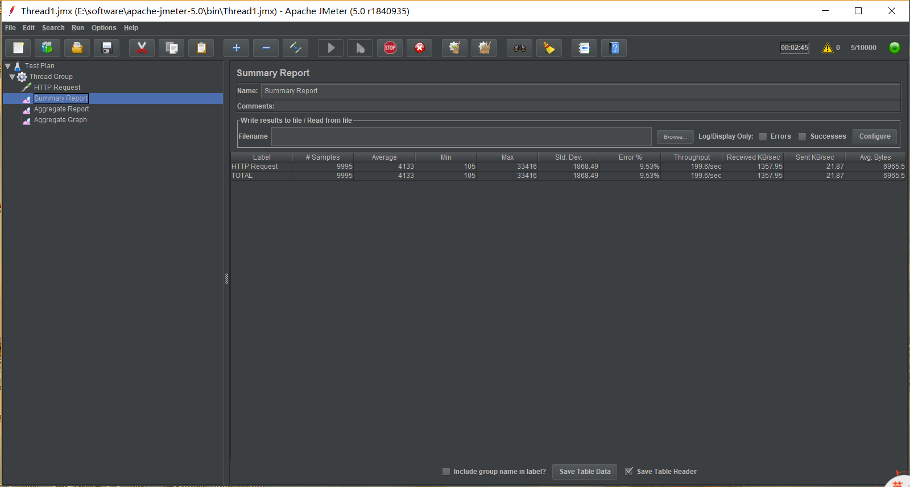

# Part 4 Load Balance 测试报告  

## 测试环境  

|项目|说明|
|-----|-----|
|操作系统|Windows 10 X64|
|CPU核数|2|
|内存容量|8G|

## 部署的服务  

本次测试在集群中一共部署了3个service，包括kubernetes,nginx,nginx-nodeport0。具体如下图：  

## 测试工具  

本次测试采用Jmeter进行测试。Apache JMeter是100%纯JAVA桌面应用程序，被设计为用于测试客户端/服务端结构的软件(例如web应用程序)。它可以用来测试静态和动态资源的性能，例如：静态文件，Java Servlet,CGI Scripts,Java Object,数据库和FTP服务器等等。JMeter可用于模拟大量负载来测试一台服务器，网络或者对象的健壮性或者分析不同负载下的整体性能。  
相对于loadrunner，jmeter更轻量级。

## 测试方法  
使用Jmeter，设置1000,3000,5000,7000,10000个线程，对于nginx服务进行测试，对nginx的 http://59.110.154.114:30238/ 页面持续发送请求。
结果如下图：  
1000线程：  

3000线程：  

5000线程：   

7000线程：  

10000线程：  

## 测试结果分析  

在本次测试中，3000线程同时发送请求时开始出现了error，当线程数为7000和10000时，无法完成整个测试流程，说明已经超过了最高的throughput。  